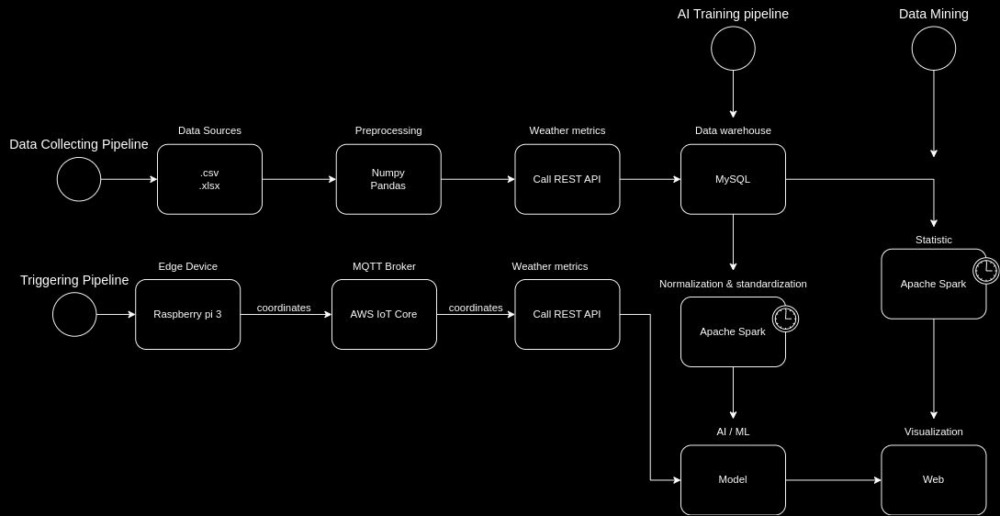

# Collecting, Analysis & Risk trigger system for landslides based on climate data

The idea was first release when I read some research and survey in the internet about the [Effect of temperature increase for the occurrence of natural landslides](https://www.researchgate.net/publication/356926856_Effect_of_temperature_increase_for_the_occurrence_of_natural_landslides) and [Impact on natural hazard of climic origin](https://www.researchgate.net/publication/283920868_Impacts_on_natural_hazards_of_climatic_origin_A_Flood_risk). There is an obvious reality in Viet Nam that landslide events and other natural disaster are underrated that especially in rural regions.

## Objective

The final target is to construct a complete system including landslide datawarehouse, trigger, analyzing & monitoring tool. Thie. The data processing session should be able to handle a high amount of data growing up day by day mbine with some AI/ML techniques to improve the triggering threshold and performance.  

## Infrastructure

The project could be divided into 4 parts: collecting & preparing datawarehouse and analysis & triggering system. The diagram below describe more detail about the system and work flow.



## Data collecting

The previous landslide occurences around the world were provided by NASA and James Gray The downloadable files could be found in the [Slide Catalog NASA](https://data.world/nasa/global-landslide-catalog) and [Global Landslide Catalog James Gray](https://data.world/jamesgray/global-landslide-catalog). Or basically in the ./datasource folder with [James Gray's dataset](./datasource/Global%20Landslide%20Data.xlsx) and [NASA's dataset](./datasource/Landslides.csv).

The climate metrics were fetched from an [Open Meteo API](https://open-meteo.com/) which provides both future forecast and past natural infomation.

## Data processing

The simple reprocessing task to extract .csv and .xlsx file and call REST API use python while the complex statistical calculation, normalization , and standardization writen in Pyspark.

## AI Model
## Web UI


## Construction

To construct the project, there are 2 parts: embedded part & cloud part. For embedded just follow the [instruction here](server_simul/raspi/README.md). 

The main computing is implemented in docker platform for a easily packaging and scaling. The detail desciption is [here](server_simul/vps/README.md)

### Setup protobuf with python compiler
Due to communication via gRPC, I suggest a proto file contains messages service definition in ./protos folder. Before building pipeline, please install dependencies for python gRPC compiler following this [guide](https://grpc.io/docs/languages/python/quickstart/). If you face an error while running the command to generate code from proto file ( like me :D), you just need to reinstall the grpc packages. 

One way to make it simpler is to use conda and create an environment using my [description file](server_simul/vps/py_executor/grpc.yml). Install conda and run the following command, an 'grpc' env will be created.
```
conda env create -f ./server_simul/vps/py_executor/grpc.yml 
```
Activate the env and run the shell script to build classes with gRPC compiler. 
```
sh generate_proto.sh
```