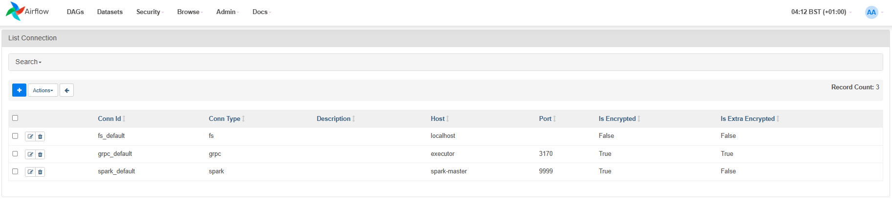

# Virtual private environment
## Implementation
All modules and services were deployed in docker. There is executor container to execute tasks and airflow container to monitoring the pipeline, they should communicate via gRPC. One notice before running the docker compose that this version of airflow might have not permission to access /opt/airflow/logs, so I recommend you to use chmod command to give permission before mounting.
```
mkdir ../../tmp/airflow_logs
chmod -R 777 ../../tmp/airflow_logs
```

## Executor
Since the main language is Python, I chose [minconda3](https://hub.docker.com/r/continuumio/miniconda3) as base image to build the service. Due to the flexibility and isolated feature of conda that could easily to implement and run multiple Python task in that container without dependency conflicting. Each description file writen in .yml contains necessary packages for each pipeline, and each pipeline represented in a conda env. Thanks to the help of this [article](https://pythonspeed.com/articles/activate-conda-dockerfile/) :D. The Dockerfile for executor image stored in py_executor folder. 

There are 2 description file in .yml for 2 conda environments, one for ingestion pipeline and other for gRPC communication. ( in dev ) 

You might build the image in order to use for docker-compose. Just run the following command to build it locally 
```
docker image build -t py_executor:<optional tag> ./py_executor
```
or pull it directly from my docker hub
```
docker image pull j3r3my0612/py_executor:1.03
```

The same as other service image such as spark & airflow, the respective Dockerfile for each image contains needed component for the project and you could manually build them in your local machine or build all image once in docker compose with the following command. Remember to switch comment the `image` and `build` in the docker-compose before building.
```
docker compose build
```

One notice that I first develop in airflow version 1 for the ingestion pipeline and then I changed to version 2 for further features. There are some diffirences in the packages already installed in each images such as grpc. You could take a look at the ver1 Dockerfile and I still remains the service in docker compose in order you want to try a lite version of ingestion pipeline without parallel execution.
## Datawarehouse
The compose only contains container and it does not autometically generate a database inside postgres. After successfully creating the compose, please make connection to postgres via tools such as: Azure Data Studio or Datagrip to easily run [DDL](tasks\sql_script\ddl.sql) and [DML](tasks\sql_script\dml.sql) scripts. 

The default `username` & `password` in the postgres are `admin` & `123456`. You could use it to connect to the db via tools and change it in docker-compose.

This is also used as backend store for airflow too. I will update a new container for postgres which already has constructed database in the near future.🤣

## Communication 
After finishing building and run the compose, you might wait a while for containers to run the services. You could go to Airflow UI in the address `localhost:8080`. From here, a few connection is essential for the DAGs to run.
### GRPC connection 
As mentioned, the airflow scheduler just managed the pipeline while the executor actually does the tasks. I used a simple protobuf to generate a gRPC conversation between scheduler & executor.

There is a required connection need to be create in order to allow the airflow scheduler to connect to executor via RPC. Go to Admin --> Connection and make a new connection like below. 

| Field Name | Value | Description |
|---|---|---|
| Conn ID | grpc_default | ID used to reference the connection in your Airflow DAG (e.g., in `src/airflow/dags/ping_grpc.py`).  |
| Conn Type | GPRC Connection | Type of connection (specific to gRPC). |
| Host | executor | gRPC server host. In this case, it uses the `executor` service within `docker-compose.yml` to proxy requests from Docker containers to the actual server host. For production setups, consider using a DNS name or an IP address. |
| Port | 3170 | Port on which the gRPC server listens. |
| Extra | {"extra__grpc__auth_type": "NO_AUTH"} | Extra configuration for the gRPC connection. Here, it specifies `NO_AUTH` to create an insecure channel over HTTP. **Warning:** This is not recommended for production environments as it lacks encryption. |
| Grpc Auth Type | NO_AUTH | Authentication type used for the gRPC connection. In this case, it's set to `NO_AUTH`, corresponding to the insecure channel created in the `Extra` field. **Warning:** Consider using a secure authentication method for production setups (e.g., TLS with client certificates). |
#### pre-requirements

Since the gRPC python components are essential for 2 container & a message service definiton is needed, I packaged the dependencies in airflow dockerfile and executor dockerfile. It would automatically install all dependencies along with compose up.This is already installed in airflow version 2 that you don't have to concern about it anymore.
### Spark connection
Befored spark installed in the airflow, it could submit the spark job via a default connection created in the airflow UI. When using the airflow version 2, by default there is no connection made and you could create one in the UI along with the GRPC connection. The detail of the connection described in the table below. 

| Field Name | Value | Description |
|---|---|---|
| Conn ID | spark_default | the name is used in the DAGs  |
| Conn Type | Spark | Type of connection (specific to spark connection). |
| Host | spark-master | spark master DNS name.  |
| Port | 9999 | Port on which the spark master listens. |

### Filesystem connection
The same as spark connection, you need to create dedfault file system connection for FileSensor in airflow's DAG.
| Field Name | Value | Description |
|---|---|---|
| Conn ID | fs_default | the name is used in the DAGs  |
| Conn Type | File | Type of connection . |
| Host | localhost | The files stored in buffer folder  |

The Airflow UI should look like this.



